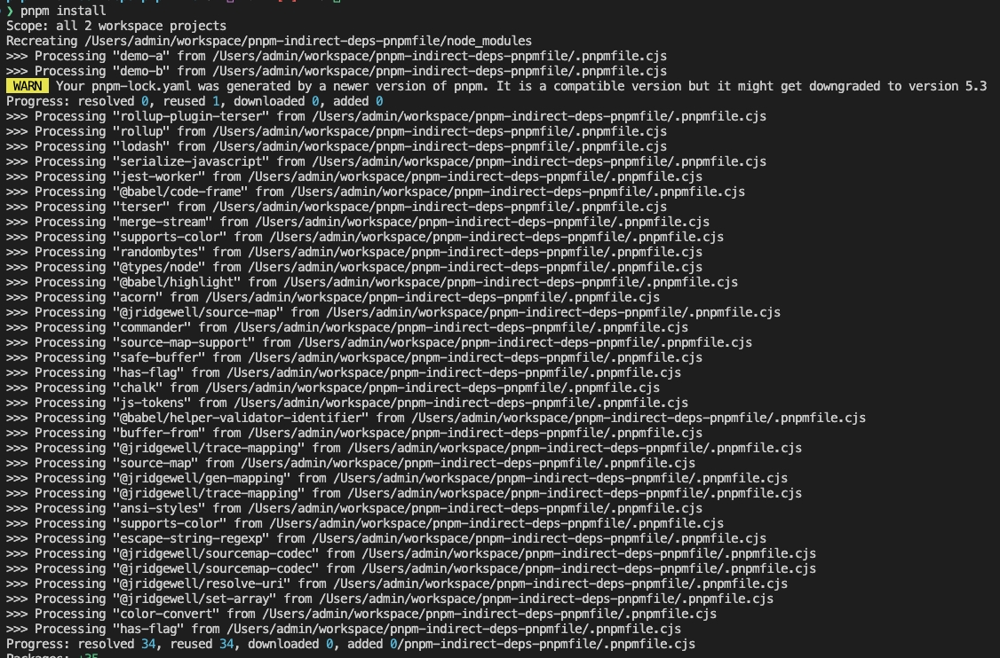
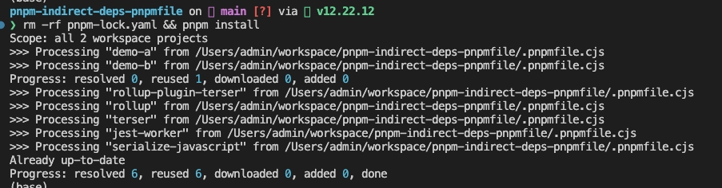

# Reproduce Steps

1. Run `pnpm install`

`readPackage` is called for all dependencies

2. Run `rm -rf pnpm-lock.yaml && pnpm install`

`readPackage` is called for some dependencies not all dependencies

# Environment

Tested in the following environments:

1. MacOS 12.6
2. Node 12, 14 + pnpm 6.32.11
3. pnpm 16 + pnpm 7.9.3, 7.17.1